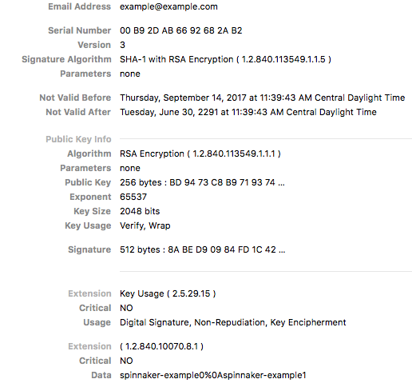
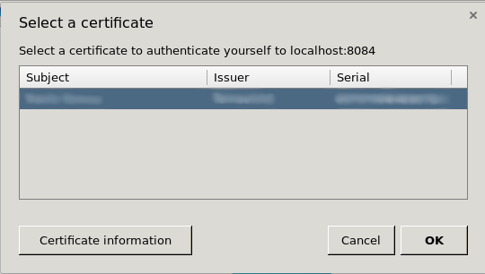

X.509 client certificates utilize public-key infrastructure (PKI) in order to authenticate
clients. X.509 can be used simultaneously with one of the other authentication methods or by
itself. Users commonly generate a certificate for their non-UI or script based clients, as this
is generally easier than dynamically obtaining an OAuth Bearer token or SAML assertion.

## Certificates

If you followed the [SSL](/docs/setup/security/ssl) guide, you may already have generated a **certificate
authority**
(CA). Using this CA, we can generate a client certificate using `openssl`.

1. Create the client key. Keep this file safe!
    ```
    openssl genrsa -des3 -out client.key 4096
    ```

1. Generate a certificate signing request for the server. Ensure the `Common Name` is set to a non-empty value.
    ```
    openssl req -new -key client.key -out client.csr
    ```

1. Use the CA to sign the server's request. If using an external CA, they will do this for you.
    ```
    openssl x509 -req -days 365 -in client.csr -CA ca.crt -CAkey ca.key -CAcreateserial -out client.crt
    ```

1. (Optional) Format the client certificate into browser importable form.
    ```
    openssl pkcs12 -export -clcerts -in client.crt -inkey client.key -out client.p12
    ```

## Encoding role information in x509 extensions

The certificates generated here only allow for the authentication of a user's identity, not user roles. If using Fiat, these certificates are not sufficient for authorization.

`roleOid` is used for this example.

Client certificates with role information are parsed when roleOid is provided. This OID is configurable and is set via Halyard. The OID provided in the example below is defined [here](http://www.oid-info.com/cgi-bin/display?oid=1.2.840.10070.8.1&action=display){:target="\_blank"}.

Encoding with any other OID can be done by editing the `openssl.conf`.

## Creating an x509 client certificate with user role information

1. Create a new Openssl config file `openssl.conf` with the following contents:

    ```
    [ req ]
    #default_bits		= 2048
    #default_md		= sha256
    #default_keyfile 	= privkey.pem
    distinguished_name	= req_distinguished_name
    attributes		= req_attributes
    req_extensions = v3_req

    [ req_distinguished_name ]
    countryName			= Country Name (2 letter code)
    countryName_min			= 2
    countryName_max			= 2
    stateOrProvinceName		= State or Province Name (full name)
    localityName			= Locality Name (eg, city)
    0.organizationName		= Organization Name (eg, company)
    organizationalUnitName		= Organizational Unit Name (eg, section)
    commonName			= Common Name (eg, fully qualified host name)
    commonName_max			= 64
    emailAddress			= Email Address
    emailAddress_max		= 64

    [ req_attributes ]
    challengePassword		= A challenge password
    challengePassword_min		= 4
    challengePassword_max		= 20

    [ v3_req ]
    keyUsage = nonRepudiation, digitalSignature, keyEncipherment
    1.2.840.10070.8.1 = ASN1:UTF8String:spinnaker-example0\nspinnaker-example1
    ```
    The final line in this file `1.2.840.10070.8.1= ASN1:UTF8String:spinnaker-example0\nspinnaker-example1` is what matters for creating a client certificate with user role information, as anything after `UTF8String:` is encoded inside of the x509 certificate under the given OID.

    Where:
    - 1.2.840.10070.8.1 - OID
    - spinnaker-example0\nspinnaker-example1 - Spinnaker user groups

    >**Note:** If providing multiple groups, as in this example, separate them with a new line (`\n`). The new line `\n` shows as a `%0A` in the certificate.

1. Generate a CSR for a new x509 certificate and the given `openssl.conf`:  
    ```
    openssl req -nodes -newkey rsa:2048 -keyout key.out -out client.csr \
        -subj "/C=US/ST=CA/L=Oakland/O=Spinnaker/CN=example@example.com" -config openssl.conf
    ```
1. Use the CA to sign the server's request. (If using an external CA, they do this for you.)
    ```
    openssl x509 -req -days 365 -in client.csr -CA ca.crt -CAkey ca.key -CAcreateserial -out client.crt
    ```



## Set roleOid

```
hal config security authn x509 edit --role-oid 1.2.840.10070.8.1
```

### Configure SSL to require certs

If you have SSL enabled, you need to set the Apache Tomcat SSL stack to require a valid certificate 
chain as required by the Spring Security integration. 

```
hal config security api ssl edit --client-auth # Set to WANT or NEED
```

There are three states for `client-auth` - `WANT`, `NEED`, and when it is unset.

Set `client-auth` to `WANT` to use a certificate if available. SSL connections will succeed even if 
the client doesn’t provide a certificate. This is useful if you enable x509 with another 
authentication method like OAuth, LDAP, SAML - when a certificate is not provided, users can still
authenticate with one of these methods.

Set `client-auth` to `NEED` if x509 is the sole authentication method, or if you want to ensure the
certificate is provided AND another authentication mechanism is used.

To revert back to not requiring a certificate after disabling x509, find and delete the `client-auth`
field set in `~/.hal/config`.

## Enable x509

```
hal config security authn x509 enable
```

## Optional settings

A `subjectPrincipalRegex` can be provided if the certificates principal name needs parsing.

```
hal config security authn x509 edit --subject-principal-regex "EMAILADDRESS=(.*?)(?:,|$)"
```

### API port



By enabling X.509 on the main 8084 port, it causes the browser to ask the user to present their
client certificate. Many end-users can get confused or annoyed by this message, so it is preferable to move this off of the main port.

You can move the client certificate-enabled port by setting `default.apiPort` value to something other than 8084. This enables an additional port configuration that is [hardcoded](https://github.com/spinnaker/kork/blob/master/kork-web/src/main/groovy/com/netflix/spinnaker/config/TomcatConfiguration.groovy){:target="\_blank"} to _need_ a valid X.509 certificate before allowing the request to proceed.

## Workflow

Unlike the other authentication methods, X.509 does not have any redirects or fancy control
passing between Deck, Gate, and a third-party identity provider. Connections are either established with a valid certificate or they're not.

## Next steps

Now that you've authenticated the user, proceed to setting up their [authorization](/docs/setup/security/authorization/).

## Troubleshooting

* Review the general [authentication guide](/docs/setup/security/authentication).
* Review the authentication [reference guide](/reference/architecture/authz_authn/authentication).


* Use an [incognito window](/docs/setup/security/authentication#incognito-mode).
