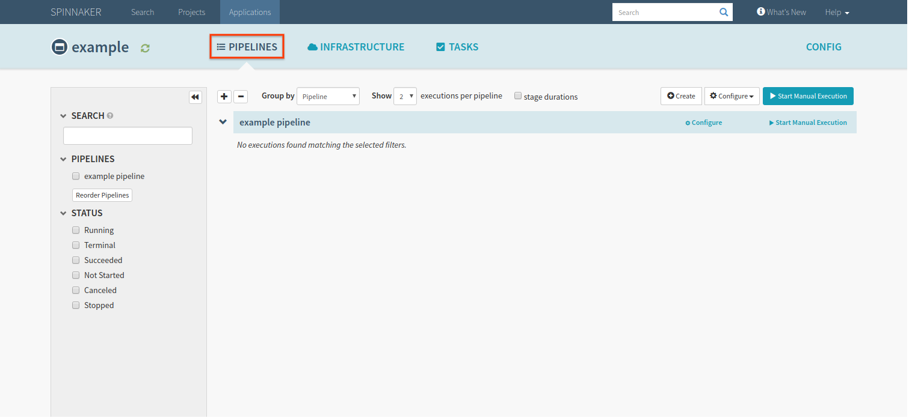
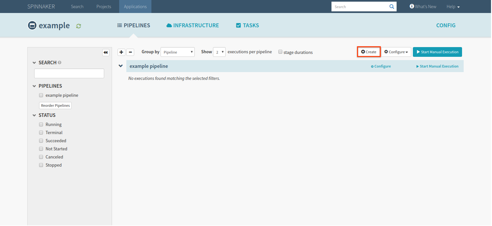
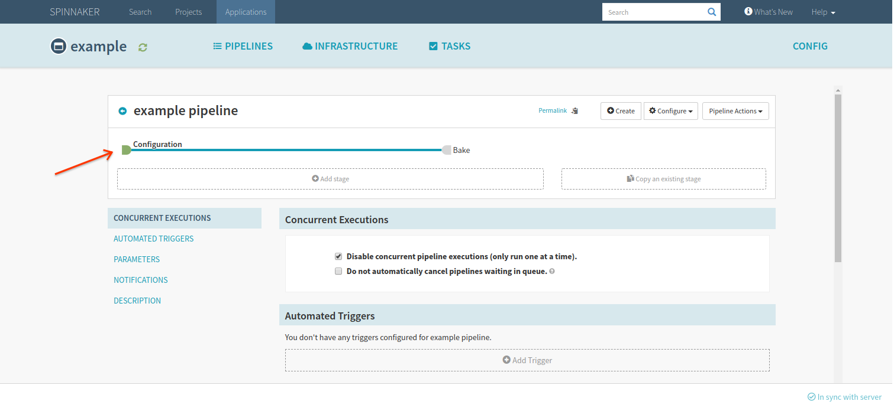
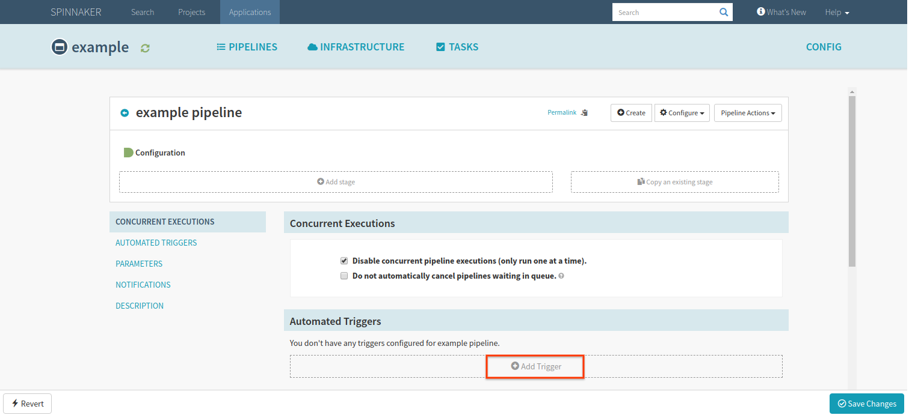
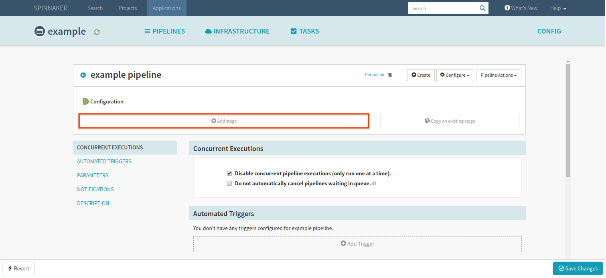
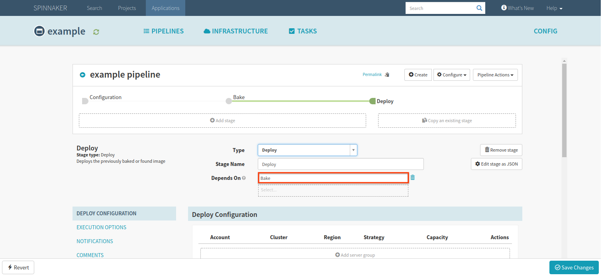
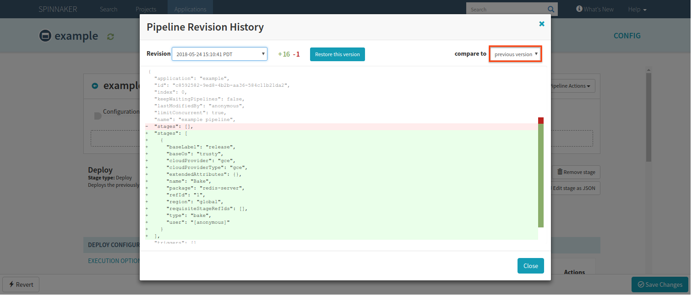
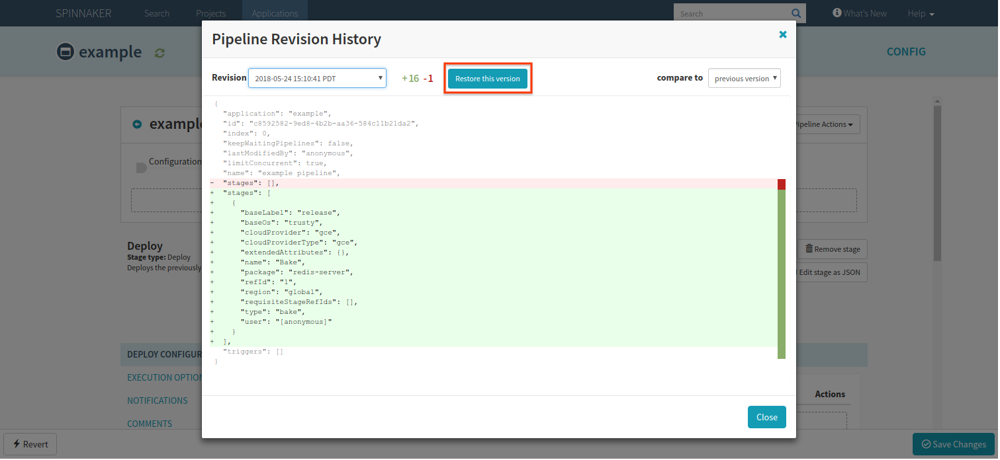



Pipelines are the essential tool in Spinnaker for controlling how to deploy your
application. A pipeline is composed of a series of stages that can be combined
in almost any order, which makes pipelines flexible, consistent, and repeatable.

You can configure your pipelines to run entirely automatically or require manual
intervention to ensure that everything is working as expected. Similarly,
pipelines can either be automatically triggered by a wide range of external
inputs, including other pipelines, or be manually triggered.

This guide explains how to configure and control pipelines, including creating,
adding triggers to, or disabling pipelines.

## Create a pipeline
1. Select the application in which you would like to create a pipeline.
2. Navigate to the **Pipelines** tab in the Spinnaker UI.
  
3. Click **Create**, located in the upper right corner of the **Pipelines** tab.
  
4. Choose **Pipeline** from the drop down menu and name your pipeline.

After you create your pipeline, add stages to specify the actions that your
pipeline will perform.

### Add a trigger

Make sure that you are editing the **Configuration** stage of your pipeline.

1. Select **Add trigger**.
  
2. Choose your desired trigger type from the drop-down menu that appears, and
input any further required configuration.

For further information on how triggers work, see the [documentation on pipeline
triggers](/docs/v1/guides/user/pipeline/triggers/).

### Add a stage
The first step in any pipeline is **Configuration**, where you can set up
pipeline triggers and parameters. Each *stage* specifies an action the pipeline
will take once it's configured.

1. Select **Add stage** from your pipeline configuration screen.
  
2. Set the stage type using the drop-down menu.
3. If this isn't the first stage in your pipeline, make sure that this stage
depends on the desired upstream stage(s) using the **Depends on** field.
  

You can add as many stages as your pipeline needs, in any order that makes sense
for you.

## Manually run a pipeline

From the **Pipelines** tab, click **Start Manual Execution** on the pipeline you
want to run. Spinnaker then shows you a confirmation dialog, where you can add
any necessary parameters.

### Linking to the Manual Execution dialog
You can create a deep link to the confirmation dialog for any pipeline by adding
a `startManualExecution` parameter to the URL for an application's pipelines 
view. The parameter's value can be either the pipeline name or its ID.

To prepopulate pipeline parameter values in the dialog, just include them as
parameters in the URL.

For example: 
  * you have an an application named "myapp"
  * the application has a pipeline named "deploy-to-prod" 
  * the pipeline has one parameter, `region`
  * the pipeline's ID is `12345`
  * your Spinnaker installation is hosted at https://my.spinnaker.example.com

These links would open the dialog automatically:
  * https://my.spinnaker.example.com/#/applications/myapp/executions?startManualExecution=deploy-to-prod
  * https://my.spinnaker.example.com/#/applications/myapp/executions?startManualExecution=12345

These links would open the dialog automatically, and pre-populate the region
parameter with `us-central-1`
  * https://my.spinnaker.example.com/#/applications/myapp/executions?startManualExecution=deploy-to-prod&region=us-central-1
  * https://my.spinnaker.example.com/#/applications/myapp/executions?startManualExecution=12345&region=us-central-1

## Disable a pipeline

Disabling a pipeline prevents any triggers from firing, as well as preventing
users from running it manually.

1. From the **Pipelines** tab, click **Configure** to modify an existing
pipeline.
  
2. Click **Pipeline actions** in the upper right corner, and select **Disable**.
  

In order to re-enable your disabled pipeline, select **Pipeline actions** and
choose **Enable**.

## Delete a pipeline

1. From the **Pipelines** tab, click **Configure** to modify an existing
pipeline.
  
2. Click **Pipeline actions** in the upper right corner, and select **Delete**.
  

## Edit a pipeline as JSON

> **Warning**: the JSON you write here is not validated -- Edit as JSON
essentially allows you to modify the pipeline via a free-form textbox. **Be
careful!** It's very easy to break the pipeline, although you can restore from
revision history to roll back any changes.

Spinnaker represents pipelines as JSON behind the scenes. Any changes you make
to your pipeline using the UI are converted to JSON when Spinnaker saves the
pipeline.

When you use the **Edit as JSON** feature, you are directly editing the payload.
**Edit as JSON** allows you to set pipeline fields or properties not exposed by
the UI.

In order to edit your pipeline as JSON:

1. From the **Pipelines** tab, click **Configure** to modify an existing
pipeline.
  
2. Click **Pipeline actions** in the upper right corner, and select
**Edit as JSON**.
  

## View and restore revision history

Each time you save your pipeline, the current version is added to revision
history. You can use revision history to diff two versions of a pipeline or to
restore an older version of a pipeline.

> *Note*: If you are using Minio or Redis as your
[storage service](/setup/install/storage/), you won't be able to use revision
history because neither supports it.

1. From the **Pipelines** tab, click **Configure** to modify an existing
pipeline.
  
2. Click **Pipeline actions** in the upper right corner, and select
**View revision history**.
  

This pulls up a window that shows a JSON representation of your current
pipeline. From there, you can see all previously saved versions via the
drop-down menu in the upper left corner.

### Diff two versions of a pipeline

You can compare any version of your pipeline to either the version before it or
the current pipeline.

1. View revision history.
2. Select a version from the **Revision** drop-down.

3. Choose whether to compare that version to the current or previous version.

### Restore a previous version

1. Choose a version from the **Revision** drop-down.
  
2. A button appears that allows you to restore your pipeline to that version. If
you restore an older version, the current version of your pipeline is saved in
your revision history in case you want to return to it in the future.
  

## Lock a pipeline

Locking a pipeline prevents all users from modifying the pipeline using the
Spinnaker UI. You can still update a locked pipeline via the API.

1. From the **Pipelines** tab, click **Configure** to modify an existing
pipeline.
  
2. Click **Pipeline actions** in the upper right corner, and select
**Lock**.
  

## Rename a pipeline
1. From the **Pipelines** tab, click **Configure** to modify an existing
pipeline.
  
2. Click **Pipeline actions** in the upper right corner, and select
**Rename**.
  
